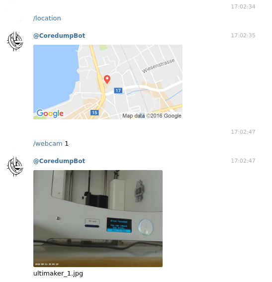

# coredumpbot

Start the Bot like this:

    TELEGRAM_BOT_TOKEN=XXXXXXXXXXXXXXXXXXXXXXX cargo run
 
or use our bot: https://telegram.me/CoredumpBot

# Install on Arch Linux

    sudo pacman -S git cargo
    git clone https://github.com/coredump-ch/coredumpbot.git
    cd coredumpbot
    TELEGRAM_BOT_TOKEN=XXXXXXXXXXXXXXXXXXXXXXX cargo run --release

# Update local Client

    cd coredumpbot
    rm -rf target
    git pull
    TELEGRAM_BOT_TOKEN=XXXXXXXXXXXXXXXXXXXXXXX cargo run --release

# Enable logging

    RUST_LOG=info TELEGRAM_BOT_TOKEN=XXXXXXXXXXXXXXXXXXXXXXX cargo run

# Set commands on Telegram

Use the [@BotFather](https://telegram.me/BotFather) with the command `/setcommands`.

    status - Get People now present
    webcam - Get Picture of Webcam
    location - Get Location of Hackerspace
    subscribe - Subscribe to a Sensor with an Duration
    help - Get Help
    cancel - Cancel Subscription
    version - Get Version of Bot
